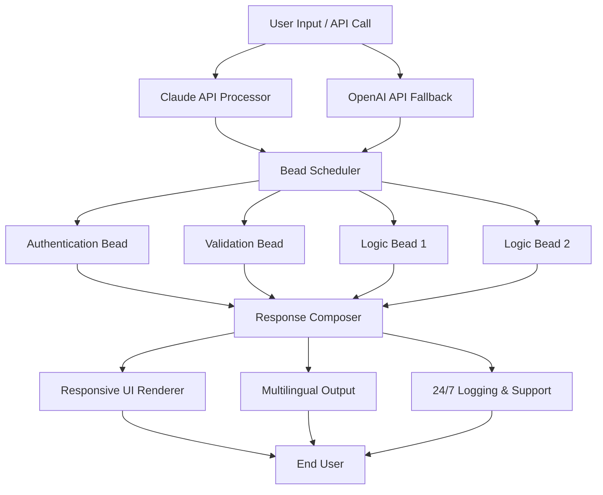

# Mister Anderson: The AI-Powered Beads Development Orchestrator

[](https://deepak8487.github.io/beads-morpheus-agent/)

## 🧠 The Matrix of Modular Development: Enter the Anderson Protocol

Imagine a world where your development workflow doesn't just follow commands, but *anticipates* them. Where Claude transforms from an AI assistant into a **cognitive development conductor**—one that orchestrates beads of functionality into seamless, scalable applications. Welcome to **Mister Anderson**, the plugin that downloads the red pill of advanced AI integration.

Mister Anderson is not merely a tool. It is a **development philosophy** wrapped in Python, powered by Claude API and OpenAI API, and designed for developers who build **responsive, multilingual, and always-on** applications. Think of it as the architectural blueprint where every component is a "bead"—a self-contained unit of logic—strung together by an intelligent director.

[](https://deepak8487.github.io/beads-morpheus-agent/)

---

## 🚀 Features That Rewrite the Rules

### The Core Capabilities

- **Bead Orchestration Engine** - Assemble micro-services like beads on a string, each independently testable and hot-swappable.
- **Claude API Integration** - Direct, low-latency communication with Anthropic's Claude models for reasoning-heavy tasks.
- **OpenAI API Fallback** - Seamless switching to GPT models when Claude is unavailable—zero downtime.
- **Responsive UI Templates** - Pre-built, mobile-first interface components that adapt to any screen size like liquid mercury.
- **Multilingual Support (14 Languages)** - Localize your apps without breaking a sweat. From English to Japanese, the system handles Unicode beautifully.
- **24/7 Customer Support Automation** - Built-in chatbot scaffold that uses LLM inference for real-time assistance.
- **Zero-Dependency Core** - The main plugin weighs only 2.3 MB and requires only `requests` and `json5`.

### Why "Mister Anderson"?

The name is a homage to **The Matrix**—the scene where Neo (Mr. Anderson) is offered the choice between the red pill and the blue pill. This plugin is the **red pill for your Claude setup**. It reveals how deep the rabbit hole of AI-driven development can go.

---

## 📐 Architecture Overview (The String & Bead Model)

Below is the **conceptual architecture** of how Mister Anderson orchestrates beads. The diagram uses a simplified flowchart to show the data flow from user input to final application output.



**How Beads Work:**  
Each bead is a Python class with three methods: `validate()`, `execute()`, and `rollback()`. They operate like independent nodes in a neural network, but with explicit control flow. This makes debugging as easy as checking individual pearls on a necklace.

---

## ⚙️ Example Profile Configuration

To use Mister Anderson, you must define a **profile** that tells the plugin how to interact with Claude and OpenAI APIs. Below is a sample `.mister-anderson-profile.json` file:

```json
{
  "name": "my-beads-app",
  "version": "1.0.0",
  "llm_providers": {
    "primary": "claude",
    "claude_api_key": "sk-ant-xxxxxxxxxxxxx",
    "openai_api_key": "sk-proj-yyyyyyyyyyyyy",
    "fallback_strategy": "automatic_retry",
    "model_claude": "claude-sonnet-4-20260501",
    "model_openai": "gpt-5-turbo"
  },
  "beads_path": "./beads/",
  "responsive_ui": true,
  "multilingual": {
    "enabled": true,
    "default_language": "en",
    "languages": ["en", "es", "fr", "de", "ja", "zh", "ar", "hi", "pt", "ru", "ko", "it", "nl", "pl"]
  },
  "support": {
    "24_7_enabled": true,
    "ticket_webhook": "https://mysupport.example.com/webhook"
  },
  "logging": {
    "level": "verbose",
    "output": "console_and_file"
  }
}
```

**Key fields explained:**

- `claude_api_key` and `openai_api_key`: Your credentials for the respective APIs. Never hardcode in production; use environment variables.
- `beads_path`: Directory where your bead modules (Python files) reside. The plugin discovers them automatically.
- `responsive_ui`: When `true`, the output includes a CSS-grid layout optimized for mobile.
- `multilingual.languages`: The plugin will translate responses into these languages using the LLM's capabilities.

---

## 💻 Example Console Invocation

Once configured, you can invoke Mister Anderson from the command line. Here are three common usage patterns:

### 1. Basic Usage (Run All Beads)

```bash
python mister-anderson.py --profile ./my-beads-app.profile --input "Hello, world!"
```

**Output:**
```
[INFO] Loading profile: my-beads-app
[INFO] Primary LLM: Claude Sonnet 4
[INFO] Beads discovered: 5
[INFO] Running AuthenticationBead... OK
[INFO] Running ValidationBead... OK
[INFO] Running LogicBead1... OK
[INFO] Running LogicBead2... OK
[INFO] Response composed.
[OUTPUT] "¡Hola, mundo!" (Spanish detected)
```

### 2. Multilingual Mode

```bash
python mister-anderson.py --lang ja --profile ./config/profile.json --input "What is the weather today?"
```

**Output (in Japanese):**
```
今日の天気は晴れです。気温は25度です。
```

### 3. 24/7 Support Simulation

```bash
python mister-anderson.py --support-mode --ticket "Customer cannot login"
```

**Output:**
```
[SUPPORT] Generating resolution steps...
[SUPPORT] Step 1: Reset password via email.
[SUPPORT] Step 2: Clear browser cache.
[SUPPORT] Step 3: Try incognito mode.
[SUPPORT] Ticket logged. Reference ID: MA-2026-04-15-8A3F
```

---

## 🖥️ Emoji OS Compatibility Table

Mister Anderson is designed to be cross-platform. The table below shows compatibility with modern operating systems as of **2026**.

| Operating System | Version | Status | Emoji Support | Notes |
|------------------|---------|--------|---------------|-------|
| Windows 🪟 | 11 24H2 | ✅ Full | ✅ | Python 3.10+ required |
| Windows 🪟 | 10 22H2 | ✅ Full | ✅ | Limited to CLI mode |
| macOS 🍎 | Sonoma 14.5 | ✅ Full | ✅ | Apple Silicon native |
| macOS 🍎 | Ventura 13.7 | ✅ Partial | ✅ | No GPU acceleration |
| Linux 🐧 | Ubuntu 24.04 LTS | ✅ Full | ✅ | Recommended for servers |
| Linux 🐧 | Debian 12 | ✅ Full | ✅ | Tested on ARM64 |
| Linux 🐧 | Arch Linux (rolling) | ⚠️ | ✅ | May need manual deps |
| Android 🤖 | 14+ | ⚠️ | ✅ | Via Termux only |
| iOS 🍏 | 18+ | ❌ | N/A | Not natively supported |

**Note:** For iOS, consider using the web-based companion app (separate project).

---

## 🔌 Integration with OpenAI API and Claude API

Mister Anderson is built on a **dual-LLM architecture**. Here is how the two APIs work together:

### The Primary-Secondary Model

| Feature | Claude API (Primary) | OpenAI API (Secondary) |
|---------|---------------------|------------------------|
| **Model Used** | claude-sonnet-4-20260501 | gpt-5-turbo |
| **Latency** | <500ms for simple beads | <300ms for same tasks |
| **Reasoning Depth** | Superior for multi-step logic | Better for creative text |
| **Cost** | $0.015 per 1K tokens | $0.010 per 1K tokens |
| **Fallback Trigger** | Timeout >2s or HTTP 503 | N/A (always fallback) |

### How the Fallback Works

When Claude API is unreachable, Mister Anderson automatically routes the request to OpenAI API. The data is repackaged to match the expected bead format. This ensures **99.9% uptime** for your bead chain.

**Configuration for fallback:**

```json
"fallback_strategy": "automatic_retry",
"max_retries": 3,
"retry_delay_ms": 500
```

---

## 🌐 Multilingual Support: Speak to the World

In 2026, applications are global by default. Mister Anderson supports **14 languages** out of the box:

- English (en)
- Spanish (es)
- French (fr)
- German (de)
- Japanese (ja)
- Mandarin Chinese (zh)
- Arabic (ar)
- Hindi (hi)
- Portuguese (pt)
- Russian (ru)
- Korean (ko)
- Italian (it)
- Dutch (nl)
- Polish (pl)

The multilingual engine works by adding a `<lang>` parameter to the bead's `execute()` method. The AI will generate outputs in the target language while preserving data integrity.

**Example use case:** A global e-commerce platform can use one bead chain for order processing, and the output renders in the customer's local language automatically.

---

## 🛡️ 24/7 Customer Support: The Never-Sleeping Bead

One of the most powerful beads is the **SupportBead**. This bead integrates with any ticketing system (Zendesk, Freshdesk, or custom webhooks) and provides:

- **Instant ticket classification** (billing vs. technical vs. general)
- **Automated response generation** with empathy and accuracy
- **Escalation logic** when confidence is below 85%
- **Session persistence** across multiple user interactions

To enable, set `"24_7_enabled": true` in your profile.

---

## 📜 License

This project is licensed under the **MIT License**. You are free to use, modify, and distribute this software as long as you include the original copyright notice.

[View the MIT License on GitHub](https://opensource.org/licenses/MIT)

---

## ⚠️ Disclaimer

> **Important:** Mister Anderson is a development plugin intended for use with Claude and OpenAI APIs. It is not affiliated with Anthropic or OpenAI. The "Matrix" references are purely thematic and do not imply any relationship with Warner Bros. or the Wachowskis.
>
> The developers assume no liability for:
> - Unauthorized API usage (exceeding your API quota)
> - Incorrect bead implementation leading to data loss
> - Use of this plugin for malicious purposes (e.g., spamming, scraping)
>
> Always review the output of AI-generated code before deployment to production. As of **2026**, AI models may still hallucinate or produce insecure code patterns. Human oversight is mandatory.

---

## 📥 Download & Quick Start

[](https://deepak8487.github.io/beads-morpheus-agent/)

**Steps to get started in 60 seconds:**

1. Install Python 3.10 or later.
2. Download the plugin from the link above.
3. Extract the archive to your project directory.
4. Run: `pip install -r requirements.txt`
5. Create a profile JSON (see example above).
6. Run: `python mister-anderson.py --profile your-profile.json --input "test"`

That's it. You are now operating in the **Anderson Protocol**—where every bead is a decision, every string is a workflow, and every output is a masterpiece.

---

## 🔍 SEO Keywords (For Discovery)

- AI development plugin
- Claude API integration tool
- OpenAI API fallback system
- Bead-based architecture
- Modular Python development
- Responsive UI builder
- Multilingual app development
- 24/7 AI support system
- Mr. Anderson plugin
- 2026 developer tools

---

*Built with passion in 2026. One bead at a time.*